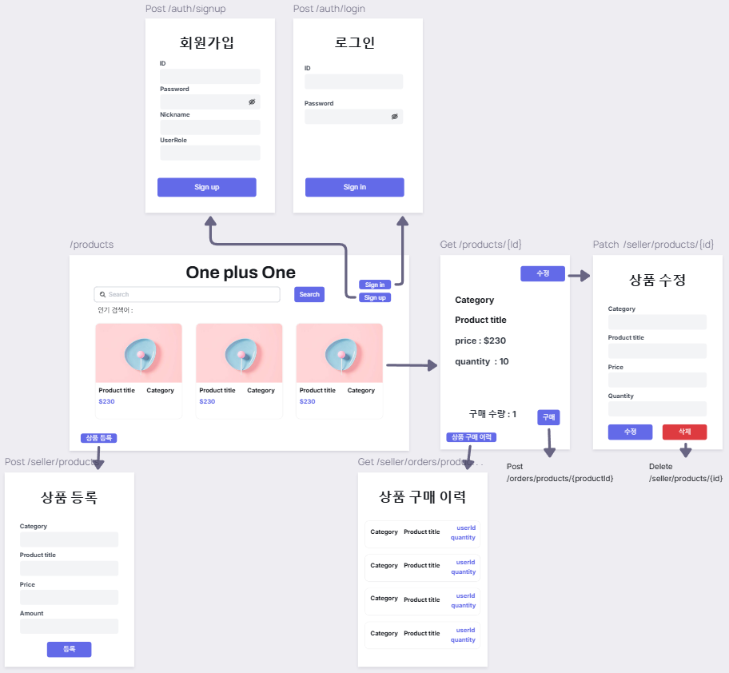
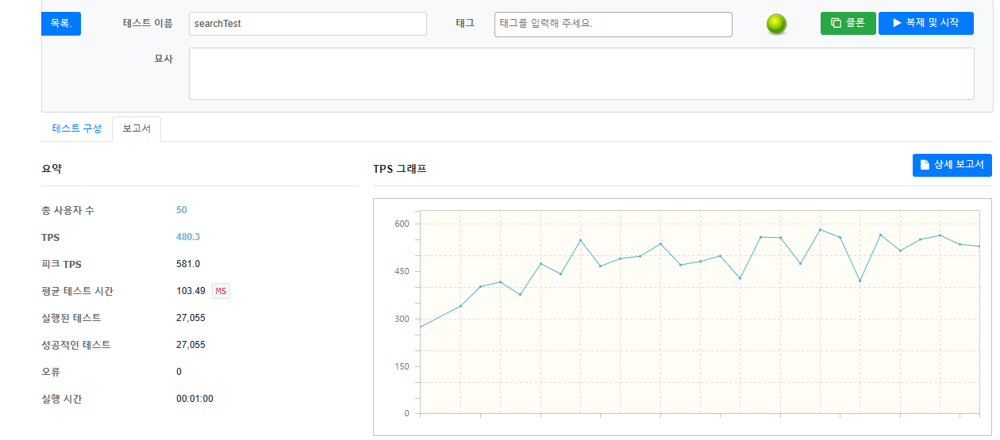
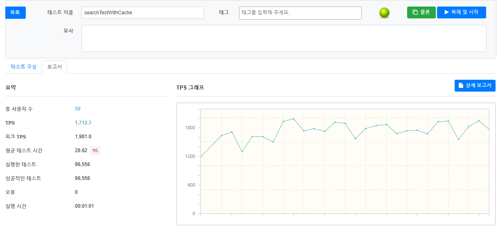

# OnePlusOne - Cache을 이용한 성능개선 + 동시성 제어 기반 쇼핑몰 API

> Redis 캐시 기반 검색 기능이 적용된 쇼핑몰 API 백엔드 프로젝트입니다.

---

## 프로젝트 소개

OnePlusOne은 사용자들이 상품을 검색하고, 인기 검색어를 실시간으로 조회할 수 있는 쇼핑몰 API 프로젝트입니다.  
검색 기능에 **로컬 캐시(Local Memory Cache)** 및 **Redis 기반 캐시(Remote Cache)** 를 적용하여 **트래픽 부하를 줄이고 성능을 개선**했습니다.

> **주요 기능**
- 상품 등록/조회 API
- 상품 검색 기능 (LIKE + 페이징)
- 인기 검색어 집계 및 조회 API
- 검색 API 캐시 적용 (v1 vs v2 비교)
- Redis 기반 인기검색어 Sorted Set 처리

---

## 프로젝트 핵심 기술 스택

| 분류 | 기술 |
|------|------|
| 언어 | Java 17 |
| 프레임워크 | Spring Boot 3.5.3 |
| 빌드 도구 | Gradle |
| DB | MySQL |
| 캐시 | Spring Cache, Redis |
| 캐시 전략 | `@Cacheable`,, Local vs Remote Cache |
| 테스트 | Postman, nGrinder |
| 배포 | 로컬 Redis |

---

## API 설계 문서

- [[백엔드] API 문서](https://www.notion.so/teamsparta/API-11-2292dc3ef5148004bfbecb626d945217)

---

## 와이어 프레임

---

## 캐싱 적용 전/후 성능비교

| 항목         | 캐싱 미적용 (v1)  | Redis 캐싱 적용 (v2)         |
| ---------- | ------------ | ------------------------ |
| 평균 응답속도    | ms        | **ms**                 |
| 최대 처리 요청 수 |  req/min | ** req/min**         |
| DB 부하      | 높음           | **낮음 (캐시 Hit 시 DB 미접근)** |

---

## 동시성 제어

### 비관적 락을 선택한 이유
- 재고 감소는 충돌 가능성이 높음
- 실시간 정합성 유지를 위해 → 충돌 자체를 막는 접근 필요
- 단일 인스턴스 환경으로, 비교적 구현이 간단한 비관적 락 사용
- 특히 구매는 데이터 무결성이 매우 중요 → 읽기와 쓰기에 대한 모든 권한을 선점하는 배타락(Exclusive Lock)을 사용

### 분산 락을 선택한 이유
- 멀티 인스턴스 환경을 대비한 확장성
- Redis 기반으로 락을 외부에서 관리 → 서버 간 일관된 제어 가능

---

## 문제 해결 (Trouble Shooting)
